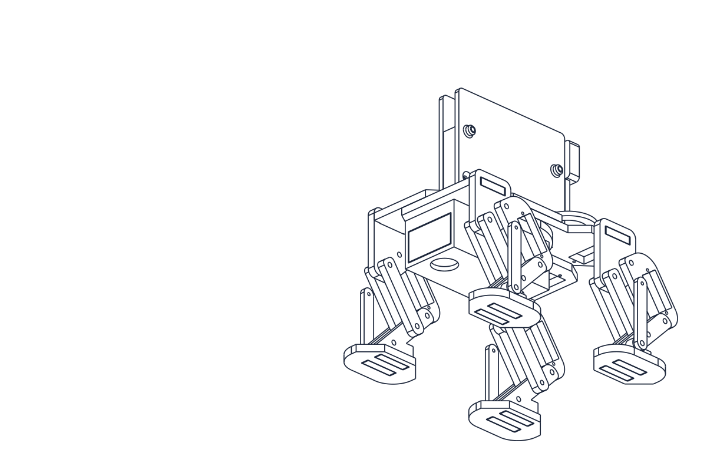
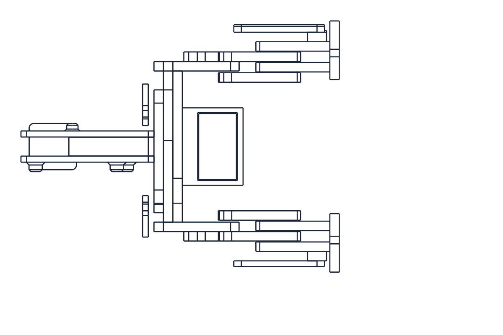

# OwlBot

OwlBot is an experimental Android “phone brain” for a small GrowBot-style robot. The phone provides the face, conversation, memory, camera, microphone, motion sensors, location-aware tools, optional local vision, and high-level decision making. A separately powered ESP32, Pico 2 W, or temporary laptop bridge drives the legs through compatible body-control hardware.

> [!CAUTION]
> **Work in progress — experimentation only. OwlBot is not production software, not safety-certified, and not suitable for unattended operation.** It can move physical hardware, use cameras and microphones, query online services, and open applications on the phone. Expect bugs, incomplete behavior, model errors, network failures, and unexpected motion. Keep the robot supervised, supported during initial tests, and away from people, pets, stairs, ledges, water, traffic, and fragile objects.

This repository is an independent community extension and is **not the official GrowBot project**.



<p align="center"><em>Smaller 9 g servo body rendered from James Bruton/XRobots' MIT-licensed <code>CAD/dog02_9g.stp</code>. This is a CAD view, not a photograph of the completed OwlBot electronics.</em></p>

## Project origins and attribution

OwlBot exists because of the original GrowBot project. Start there for the creature, body concept, and official ESP32 build process:

- [Original GrowBot project](https://growbot.dev/)
- [Original GrowBot source repository](https://github.com/britcruise9/GrowBot)
- [Original GrowBot ESP32 build guide](https://growbot.dev/build-esp32)
- [GrowBot software license: PolyForm Noncommercial 1.0.0](https://github.com/britcruise9/GrowBot/blob/main/LICENSE)

GrowBot code is available for noncommercial use, modification, and sharing under PolyForm Noncommercial 1.0.0. GrowBot hardware and documentation have separate CC BY-NC 4.0 terms. Commercial GrowBot licensing is available from its owners at `info@growbot.dev`. GrowBot names, artwork, designs, services, firmware, and trademarks belong to their respective owners.

The six-servo body used for the current OwlBot prototype is the smaller **9 g servo variant** (`CAD/dog02_9g.stp`) designed by **James Bruton / XRobots** and released under the MIT License. The upstream project also contains a separate standard-servo `dog02_large.stp` body; that is not the body used by this prototype.

- [XRobots YouCanBuildDog repository](https://github.com/XRobots/YouCanBuildDog)
- [The Six-Servo Robot Dog — it's open source!](https://www.youtube.com/watch?v=2eKb_2N0SBI&t=1s)
- [YouCanBuildDog MIT License](https://github.com/XRobots/YouCanBuildDog/blob/main/LICENSE)

The MIT license permits use, modification, distribution, sublicensing, and sale of the body project's materials, provided its copyright and permission notice remain with copies or substantial portions. Copyright © 2026 James Bruton. OwlBot replaces the original electronics and control software of the smaller 9 g body for this experiment; its mechanical design remains credited to James Bruton.

This repository does not claim authorship of GrowBot or the YouCanBuildDog body. It contains the OwlBot Android phone-brain and integration work, and communicates with compatible robot controllers and the GrowBot relay/protocol where configured.

<details>
<summary>Additional body view</summary>



Both documentation images were generated from the upstream STEP model. Their exact provenance and reproduction instructions are in [`docs/images/README.md`](docs/images/README.md).

</details>

## AI-assisted development

OwlBot was developed collaboratively by its human maintainer with substantial assistance from **OpenAI Codex**. Codex was used as an engineering agent to inspect and modify source code, reason about architecture, diagnose Android and hardware-integration problems, draft and revise documentation, perform licensing and provenance inventories, scan for exposed secrets, run builds and automated tests, and help interpret logged behavior from phone, ESP32, Pico, relay, and servo-controller experiments.

The human maintainer chose the project goals, supplied the hardware and observations, granted permissions, evaluated behavior on physical devices, made publication decisions, and remains responsible for reviewing, testing, maintaining, and distributing the project. AI-generated or AI-edited work can contain mistakes; inclusion in this repository means it was accepted into the project, not that OpenAI independently verified or endorses OwlBot.

OpenAI and Codex are credited for development assistance only. OwlBot is an independent community project and is not affiliated with, sponsored by, or endorsed by OpenAI.

## What OwlBot does

The current source snapshot is Android app version **4.1**. Its major systems are:

- An animated, expressive face rendered in an embedded HTML/Canvas interface.
- A priority-based contextual expression resolver covering protection, danger, listening, thinking, speaking, success, frustration, uncertainty, relief, affection, play, focus, boredom, and reasoned model appraisal. Automatic failure produces confusion/focus rather than invented anger; anger requires an explicit current model appraisal with a concrete reason.
- Push-to-talk conversation with configurable OpenAI-compatible model endpoints.
- Ollama Cloud support using an API key supplied by the individual user.
- Local Ollama support for setups that provide an accessible LAN endpoint.
- Persistent local conversation memory, people notes, experiences, goals, tasks, lessons, inner-life state, and self-model state.
- Situation-aware personal goals and an experimental autonomy executive.
- Phone sensor integration: acceleration, gravity, gyroscope, orientation, light, pressure, proximity, steps, battery, thermal state, and location when permission is granted.
- A global thermal governor that sheds camera/render/sensor load at moderate heat and stops model, body, microphone, GPS, and continuous sensors at severe heat until a sustained cooldown, with a distinct animated cooling face.
- Camera perception, optical flow, generic person presence, and optional local facial recognition.
- Facial recognition that defaults off, can be toggled at any time, and keeps face templates on the phone.
- A rest mode that closes the eyes, shows sleeping animation, stops the mind and body, and disables camera/microphone transmission until touch wakes OwlBot.
- Cloud vision through the model provider selected by the user. Separately licensed local-model weights and download code are intentionally excluded from the community build.
- Live web research, Google News headlines, Open-Meteo weather, and source-aware tool results.
- Owner-visible phone actions such as finding/opening installed apps, handing music requests to Pandora, media controls, and opening an email draft for review. OwlBot does not silently send email.
- Local MIDI synthesis for short scores transcribed from visible sheet music.
- GrowBot body control through the stock pairing-code relay without a separate control token.
- A hardened direct-body protocol option for experimental controllers that implement token authentication.
- A `quad8` mode that sends bounded walk, turn, gaze, rest, and stop intentions while the body controller owns every eight-joint sequence.
- A dry-run-first Windows laptop bridge for testing a Pololu Mini Maestro without an ESP32 or Pico present.
- Explicit gestures, gait control, turn/forward commands, acknowledgement tracking, dead-man stop behavior, calibration, and experimental gait learning.
- Optional two-axis gimbal support for autonomous gaze when compatible firmware is installed.

## System overview

| Layer | Runs on | Responsibility |
|---|---|---|
| Native Android host | Phone | Permissions, sensors, camera frames, speech recognition, encrypted secrets, Android TTS, app intents, weather/search/news requests |
| OwlBot brain UI | Android WebView | Face, memory, goals, autonomy, model tool loop, behavior selection, body controls, configuration |
| Mind provider | Ollama Cloud, local Ollama, or compatible endpoint | Language/vision reasoning and tool selection |
| Body transport | LAN WebSocket or GrowBot relay | Pairing, movement messages, acknowledgements, status |
| Body controller | ESP32, Pico 2 W, or test laptop | Servo sequencing, Maestro communication, body presence, and controller-level stop/dead-man behavior |

See [docs/ARCHITECTURE.md](docs/ARCHITECTURE.md) for the runtime and data flows.

## Repository layout

```text
app/
  build.gradle
  src/main/
    AndroidManifest.xml
    assets/growbot-brain.html       OwlBot UI, memory, goals, tools, and behavior
    java/dev/owlbot/brain/
      MainActivity.java             Android bridge, sensors, Android TTS, and phone tools
tools/laptop-maestro-bridge/        Dry-run-first Windows-to-Maestro test controller
    res/                            Theme and launcher resources
docs/
  ARCHITECTURE.md                   Components and control/data flows
  PRIVACY.md                        Data handling and external services
scripts/
  check-secrets.ps1                 Repository credential guard
tools/
  mind-proxy.mjs                    Optional environment-variable-only CORS proxy
.github/workflows/android.yml       Secret check and clean Android build
```

Generated APKs, downloaded models, local Gradle state, Android SDK paths, signing keys, audit logs, phone backups, conversations, face templates, Wi-Fi credentials, pairing codes, API keys, and device identifiers are intentionally excluded.

## Requirements

- Android 8.0 / API 26 or newer.
- Android Studio with Android SDK 34, or command-line Android SDK tools.
- Java 21 for the documented build toolchain; OwlBot's Android source compatibility remains Java 17.
- Internet access for cloud-model, search/news/weather, relay, and any online services used by the Android speech engine selected on the phone.
- An Ollama account/key for Ollama Cloud, or an accessible local/compatible model endpoint.
- For physical motion: a safely assembled GrowBot-compatible body and ESP32 firmware. Follow the original [GrowBot ESP32 guide](https://growbot.dev/build-esp32).

Local-model weights are not bundled or automatically downloaded by the community edition. Review a model's license and terms before adding it to a private build.

## Thermal and physical cooling

OwlBot's screen, camera, WebView, sensors, charging circuit, and radio all share a small phone enclosure. Version 4.1 reduces software load automatically, but sustained robot use can still benefit from active airflow. If adding a fan:

- power it from a separate regulated supply rather than the phone battery or servo rail;
- aim airflow across the rear frame/battery area without letting blades, screws, or conductive guards touch exposed phone electronics;
- provide both inlet and outlet space—the vented case must not recirculate its own hot exhaust;
- keep dust, metal debris, moisture, and condensation away from the uncovered phone;
- compare Android thermal status and battery temperature before/after instead of relying only on how the case feels.

Stop using the phone immediately if the battery swells, develops an odor, becomes unusually soft, or the display/frame begins separating. Active cooling does not make a damaged lithium battery safe.

## Build from source

Never put API keys in Gradle files or source code. No key is needed to compile OwlBot.

### Android Studio

1. Clone this repository.
2. Open the repository root in Android Studio.
3. Allow Gradle to sync.
4. Select the `app` configuration.
5. Build or run the debug variant on an Android device.

### Command line

Windows:

```powershell
git clone https://github.com/Aaronminer1/owlbot.git
Set-Location owlbot
.\gradlew.bat assembleDebug
```

macOS/Linux:

```bash
git clone https://github.com/Aaronminer1/owlbot.git
cd owlbot
./gradlew assembleDebug
```

The debug APK is generated at:

```text
app/build/outputs/apk/debug/app-debug.apk
```

Install with ADB:

```bash
adb install -r -g app/build/outputs/apk/debug/app-debug.apk
```

Debug builds use Android’s standard debug certificate. The release build is intentionally unsigned; community or production distributors must use their own protected signing key and review the entire app first.

## First-time setup

### 1. Configure the mind

OwlBot ships with **no API key**.

1. Open OwlBot’s Controls screen.
2. Choose `Ollama Cloud`, `Ollama local`, or a compatible custom endpoint.
3. Enter your own endpoint and, if required, your own API key.
4. Refresh the model list and choose a model with the capabilities you want.
5. Return to the face to wake the mind.

The Android app stores the model key and optional hardened body token using Android Keystore-backed AES-GCM encrypted storage. They are not kept in the HTML preferences object and are not present in this repository.

For Ollama Cloud keys, use Ollama’s own account/settings interface. Do not paste a key into an issue, discussion, log, screenshot, source file, or commit.

### 2. Configure the GrowBot body

1. Build and flash the body using the original [GrowBot ESP32 guide](https://growbot.dev/build-esp32).
2. Give the ESP32 its own Wi-Fi credentials through the official provisioning process. Wi-Fi credentials do not belong in this repository.
3. In OwlBot Controls, enter the pairing code printed by the ESP32.
4. Leave **Use stock GrowBot relay** enabled for the original firmware.
5. No control token is needed for stock GrowBot firmware.
6. Tap Connect and wait until the body reports online.
7. Support the body off the ground and test one leg/gesture at a time before attempting a gait.

The default relay address is the original GrowBot relay endpoint. Relay service availability and terms are controlled by the original project, not by this repository.

### 3. Grant capabilities deliberately

Android will request only the permissions needed by the features you enable. Review [docs/PRIVACY.md](docs/PRIVACY.md) before granting camera, microphone, location, activity recognition, or installed-app visibility.

Useful initial sequence:

1. Enable sensors.
2. Enable the camera only if vision is needed.
3. Keep facial recognition off unless you intentionally want local recognition.
4. Connect the body.
5. Verify STOP.
6. Test center, one leg, and a small gesture.
7. Only then enable autonomous leg or app capabilities.

## API-key policy

This repository will never include a shared Ollama API key. Every user must provide their own key or use their own local endpoint.

- Do not commit `.env`, `local.properties`, credentials, pairing codes, or tokens.
- Do not hardcode keys in `growbot-brain.html`, Java, Gradle, scripts, screenshots, or documentation.
- Use Android’s in-app key field for phone storage.
- If using `tools/mind-proxy.mjs`, supply `OLLAMA_API_KEY` and `OWLBOT_PROXY_TOKEN` as process environment variables.
- Run `pwsh scripts/check-secrets.ps1` before every push.
- If a key is ever exposed, revoke it immediately; deleting it from the latest commit is not enough because Git history retains it.

The optional proxy refuses non-loopback listening unless a separate client token is configured. It does not contain credentials and does not read an `.env` file automatically.

## Privacy and network behavior

OwlBot is local-first, but it is not automatically offline. Depending on configuration and enabled features, information can leave the phone:

- Model turns may include the released push-to-talk transcript, relevant memories, sensor summaries, tool results, and a current camera frame when cloud vision is enabled.
- Weather sends coordinates to Open-Meteo only when the weather tool is called.
- Search and news send the text query to external search/news providers.
- Android TTS sends speech text only according to the speech engine selected in the phone's Android settings; that engine may operate locally or online.
- Android speech recognition may use the phone vendor’s online service.
- The GrowBot relay carries pairing/status/motion messages between phone and ESP32.

Face descriptors, memories, and encrypted credentials are stored locally by this app. Rest mode stops the model loop and disables camera/microphone transmission until touch wakes OwlBot. See [docs/PRIVACY.md](docs/PRIVACY.md) for the complete inventory and deletion notes.

## Safety and current limitations

- A language model can misunderstand a request, call the wrong tool, repeat itself, or produce a false claim.
- Servo motion has no guarantee of balance, traction, obstacle avoidance, or mechanical safety.
- Phone orientation is not automatically the same thing as robot-body orientation; the mount must be calibrated and verified.
- Camera optical flow is an experimental movement signal, not localization or collision avoidance.
- Stock relay pairing codes are compatibility credentials, not strong cryptographic authentication.
- LAN `ws://` control and WebView universal file access are prototype compatibility choices that require security review before any production use.
- Search providers can change markup or block automated requests.
- Phone app actions depend on installed packages and Android intent support.
- Local vision is large, hardware-dependent, and may be too slow or memory-intensive on older phones.
- Autonomy is experimental. Do not leave the robot unattended or permit unsupervised external side effects.
- This project has not completed professional accessibility, penetration, privacy, electrical, mechanical, thermal, or regulatory review.

## Development and verification

Before opening a pull request:

```powershell
pwsh scripts/check-secrets.ps1
.\gradlew.bat clean assembleDebug
```

At minimum, verify:

- Fresh install and upgrade install.
- Rest stops mind, camera, microphone, speech, and body motion.
- STOP works when connected.
- Stock pairing-code relay connects without a control token.
- Gestures receive an ESP32 acknowledgement.
- Forward and pure-turn movement stop after the requested time.
- API-key fields are empty in a clean install.
- Facial recognition defaults off and stays off after restart.
- No real credential, pairing code, Wi-Fi name/password, device ID, location, or conversation appears in the diff.

Hardware tests must describe the exact phone, Android version, ESP32 variant, firmware, servo power arrangement, and whether the body was supported off the ground.

## Contributing

Community experiments, bug reports, documentation, and narrowly scoped pull requests are welcome. Read [CONTRIBUTING.md](CONTRIBUTING.md) and [SECURITY.md](SECURITY.md) first. Never report a security vulnerability by posting a real secret or precise private location in a public issue.

## License status

OwlBot is publicly shared for **noncommercial purposes** under [PolyForm Noncommercial 1.0.0](LICENSE). Redistribution must preserve the license and every `Required Notice:` line. Commercial use is not granted.

Relevant upstream terms are not interchangeable:

- GrowBot software is PolyForm Noncommercial 1.0.0 and therefore noncommercial unless its owner grants a separate license.
- GrowBot hardware and documentation are CC BY-NC 4.0.
- James Bruton's YouCanBuildDog body repository is MIT licensed and allows commercial use with preservation of its copyright and permission notice.
- Third-party Android libraries, services, voices, and model weights retain their own licenses and terms.

See [NOTICE.md](NOTICE.md), [THIRD_PARTY_NOTICES.md](THIRD_PARTY_NOTICES.md), the [dependency inventory](DEPENDENCIES.md), and the documented [publication review](LEGAL_REVIEW.md).

## Project status

OwlBot is an evolving personal robotics experiment. Interfaces, stored data formats, model prompts, body protocols, behavior, and setup steps may change without migration guarantees. Use it to learn, test, and contribute—not as a finished product.
